# RETAILOR MEDIA GTM TEMPLATE

The **RetailorID Custom Template** is the official GTM template for installing the Retailor Media script and its components.

---

## PERMISSION

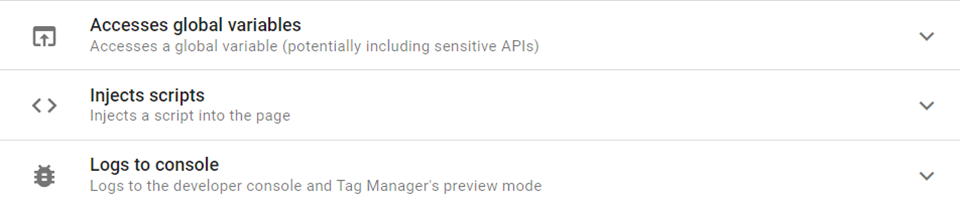

---

## 1. CONFIGURATION SETTINGS (BASIC)

To activate the script, it is necessary to insert the **PROVIDER ID** provided by Retailor Media. Along with the provider ID, you will need to set up the template to send a standard `pageview` event. For basic implementations, no additional parameters or configurations are required.

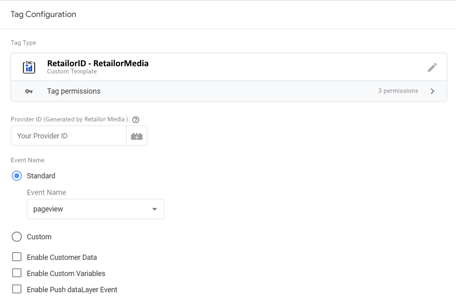

It is possible to activate the Retailor Media tag on the native GTM activator **"All Pages."**

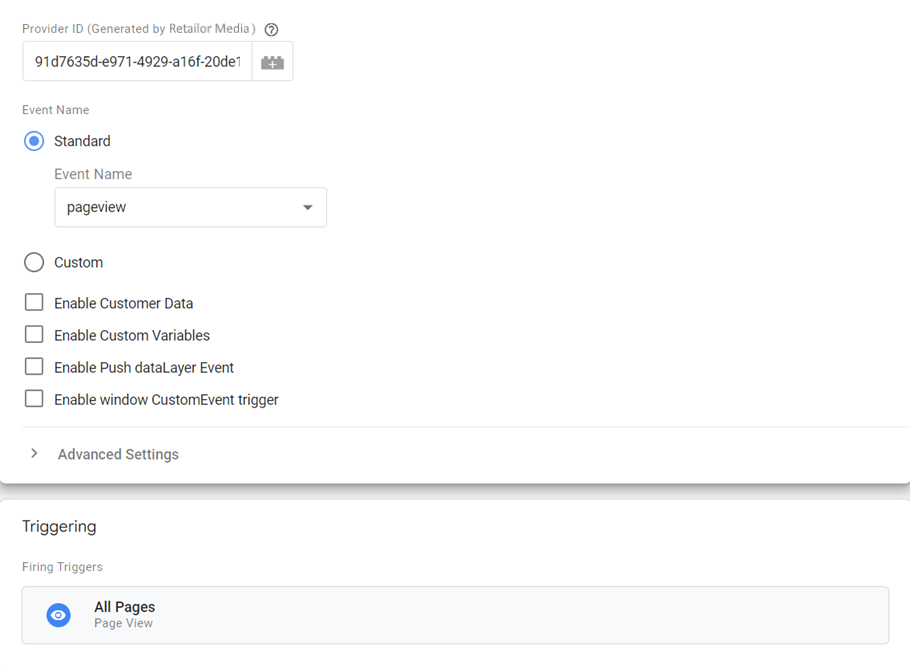

The tag should be activated only if the user gives consent to profiling cookies (or similar technologies). Typically, various Consent Management Platforms (CMPs) provide indications in the data layer regarding the type of consent provided.

If your CMP does not support [TCF2](https://iabeurope.eu/transparency-consent-framework), it is advisable to activate the tag only if consent is given for profiling cookies.

If, on the other hand, your CMP supports TCF2, then you can associate the activation of the tag with the expressed consent for the vendor **Retailor Media S.R.L (IAB code 1532)**.

---

## 2. CONFIGURATION SETTINGS ECOMMERCE (Advanced)

If our website is an e-commerce site or a more complex site, we will definitely need to send multiple events beyond the simple initial pageview, such as the checkout or the purchase of a specific product.

Here is a list of dedicated standard events:

| Event Name     | Description                          |
|----------------|--------------------------------------|
| `pageview`     | Generic pageview                     |
| `add_to_cart`  | Product added to cart                |
| `view_cart`    | Pageview cart                        |
| `checkout`     | Pageview checkout                    |
| `view_product` | Pageview product page                |
| `purchase`     | Pageview post purchase               |
| `lead`         | Thank you page after form submission |

Here are some recommendations for implementation. Firstly, you should insert the `pageview` event on all pages of the website, just as with the basic implementation. After inserting the pageview event, you can add other events that capture specific moments or actions in the user's conversion funnel. For example, you could insert the `view_product` event when the user views a product page on our e-commerce site.

---

### 2.1. EXCEPTION PAGES

There are certain pages, such as Product Detail Pages (PDP), where two requests to Retailor Media servers will inevitably be triggered — one set in the `pageview` event and another in the `view_product` event. When both the `pageview` event and a specific standard event are triggered on the same page, we refer to them as **"exception pages."**

A good practice is to avoid triggering the generic pageview tag on these exception pages and to keep only the tag with the dedicated event active.

Here are some exception pages:

- **PDP** (pageview event + view_product event)
- **Cart** (pageview event + view_cart event)
- **Checkout** (pageview event + checkout event)
- **Purchase** (pageview event + purchase event)
- **Lead**, if tracked with TY trigger (pageview event + lead event)

To prevent the double firing of a request to Retailor Media servers, it is advisable to identify these exception pages using variables, which can be JavaScript-based or related to the URL of the pages if identifiable. Usually, there is a variable in the data layer or the URL that allows the identification of the page category.

For example, on the Product Detail Page (PDP), you might have a `pageType` variable in the data layer.

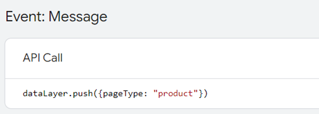

At this point, you can create an exception trigger for the tag with the `pageview` event to prevent it from being activated on exception pages.

Here's how you can create an exception trigger based on the `pageType` variable being equal to `"product"`:

1. Open your Google Tag Manager (GTM) and go to the **"Triggers"** section.
2. Click on **"New"** to create a new trigger.
3. Select **"Exception Trigger."**
4. Assign a meaningful name to your trigger, for example, `"Exception - Product Pages."`
5. In the **"Conditions"** section, select `"Page Type"` (make sure this variable is correctly populated in your data layer).
6. Set the condition so that `pageType` is equal to `"product."`
7. Save the trigger.

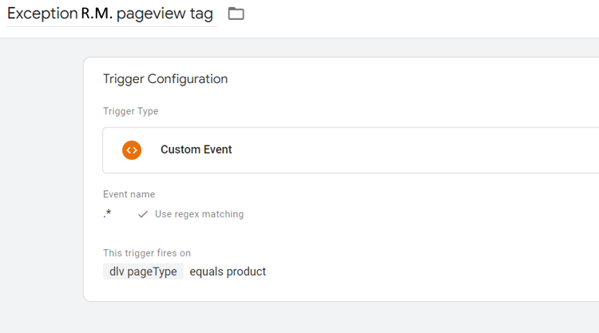

By associating this exception trigger with your tag containing the `pageview` event, you will prevent the tag from firing on pages where the dedicated `view_product` event is expected. This way, you will avoid the double firing of requests to Retailor Media servers on these specific pages.

For convenience, you could already list all the exception pages and include them in your exception trigger, identifying them with a variable — in this case, `"dlv PageType."`

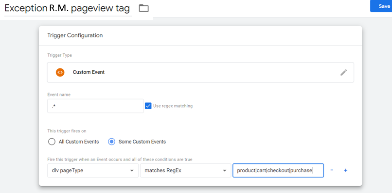

At this point, you can insert the exception trigger created for the Retailor Media pageview tag and freely add tags for other dedicated events.

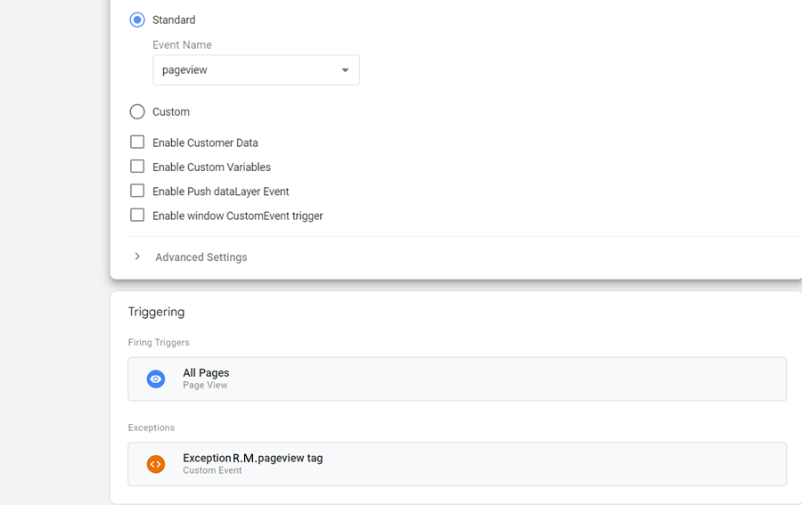

> **Naming convention:** name the exception trigger `Exception Retailor Media pageview tag` so it is easy to identify in the GTM interface.

---

### 2.2. CUSTOMER DATA

Customer data typically refers to attributes associated with the user. They can be sent along with any event and are appropriately handled directly by Retailor Media.

| Field | Description |
| --- | --- |
| **Email** | User's email. Can be sent in full or already hashed in SHA256 format. |
| **CRM User ID** | User ID identifiable in a CRM system. |
| **External User ID** | Any identifier of the user. |
| **Phone Without Country Prefix** | User's phone number without the country prefix, e.g., `3333333333` |

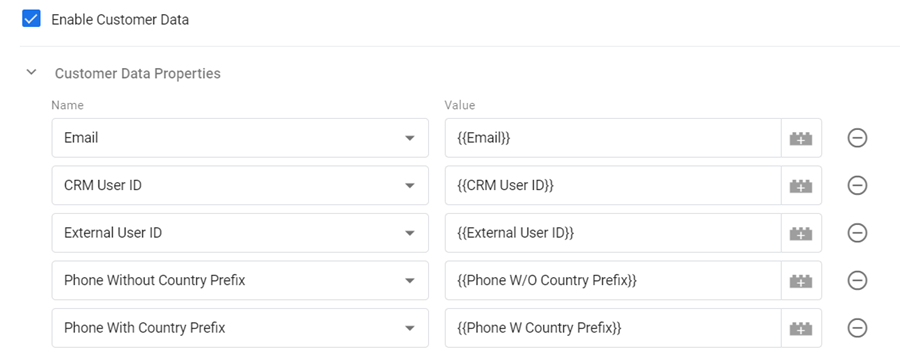

---

### 2.3. CUSTOM VARIABLE

Custom variables are key-value-type triplets that can be sent along with events. They can be simple strings or have other types of formats.

Here is an example of a custom variable. Let's say we want to send an `add_to_cart` event when the user adds a specific product to the cart, and we want to identify details about the product sent. In this configuration, you can insert the details of the product as `items` and associate their value with the variable `{{dlv items}}`.

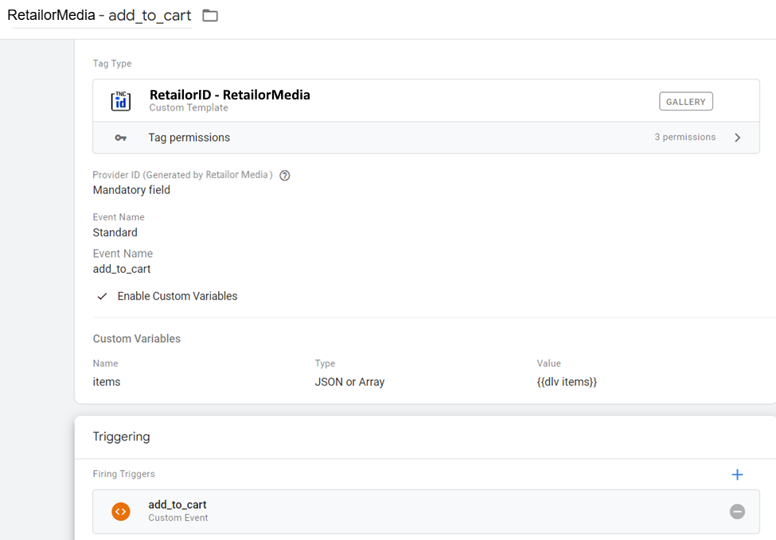

You could send product information through a custom variable of type **'JSON or Array'**. If you have GA4 datalayer configuration enabled, you can use the same `items` variable.

Here's what the `items` variable must include. Typically, the `items` variable is an array of objects. Each object must contain:

- `item_id` (string)
- `item_name` (string)
- `price` (float)
- `quantity` (integer, float)
- `item_category` (string)
- `item_category2` (string) — *OPTIONAL*
- `item_category3` (string) — *OPTIONAL*
- `currency` (string)
- `item_brand` (string)

Example of the `items` variable:

```javascript
items: [
  {
    item_id: "SKU_12345",
    item_name: "Stan and Friends Tee",
    item_brand: "Google",
    item_category: "Apparel",
    item_category2: "Adult",
    item_category3: "Shirts",
    price: 10.01,
    quantity: 3,
    currency: "EUR"
  },
  {
    item_id: "SKU_12346",
    item_name: "Google Grey Women's Tee",
    item_brand: "Google",
    item_category: "Apparel",
    item_category2: "Adult",
    item_category3: "Shirts",
    price: 21.01,
    quantity: 2,
    currency: "EUR"
  }
]
```

When you send the `purchase` event, you also need to add some custom variables:

| Variable           | Type   |
|--------------------|--------|
| `transaction_id`   | string |
| `value`            | float  |
| `currency`         | string |
| `payment_method`   | string |

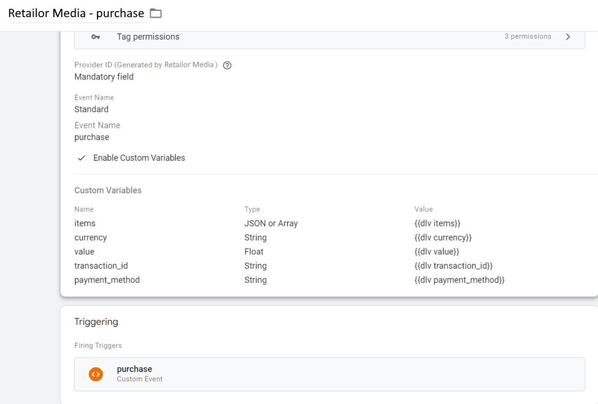

In some cases, you can send custom events that are not in the list. For example, you can send a `view_category` event when a user lands on a category page. In this case, it is not necessary to send all the `items` information — you can send only the `item_category` as a string custom variable.

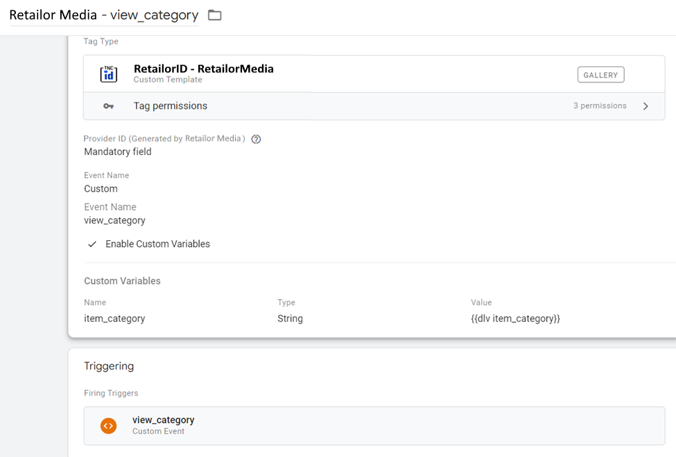

---

### 2.4. PUSH DATALAYER EVENT

It is possible to trigger a custom event in the data layer with the **RetailorID**. Enable the **"Enable Push dataLayer Event"** option in the template and set the event name to `retailorid-retrieved` (default value).

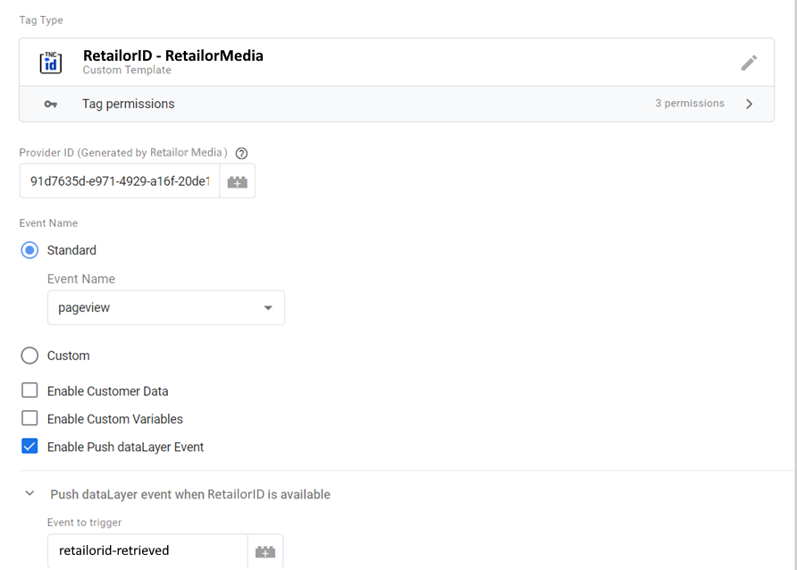

When the Retailor Media tag fires, it will push the following event to the DataLayer:

```javascript
dataLayer.push({
  event: "retailorid-retrieved",
  retailorid: "xxxxxxxx-xxxx-xxxx-xxxx-xxxxxxxxxxxx",
  gtm.uniqueEventId: 232
})
```

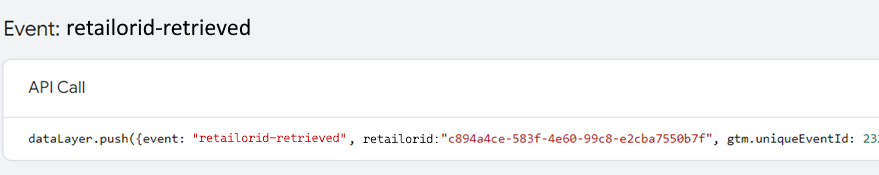

Thanks to this push, you can create a **DataLayer Variable** in GTM to capture the `retailorid` value:

- **Variable Type:** Data Layer Variable
- **Data Layer Variable Name:** `retailorid`
- **Data Layer Version:** Version 2

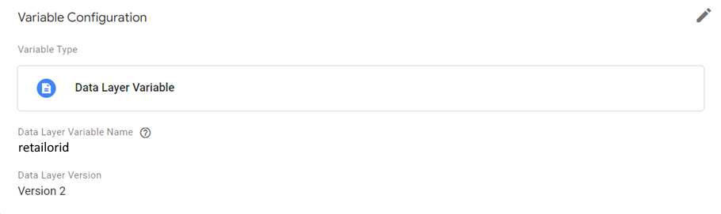

Here is an example of integration between Retailor Media and GA4, allowing the use of RetailorID as a `user_property` for cross-device user recognition and the construction of advanced attribution models on BigQuery.

**Step 1 — Create a Custom Event trigger:**

- **Trigger name:** `RetailorIDRetrieved`
- **Trigger Type:** Custom Event
- **Event name:** `retailorid-retrieved`

**Step 2 — Create a GA4 Event tag:**

- **Tag name:** `Retailor Media - retailor_get`
- **Measurement ID:** `G-XXXXXXXX`
- **Event Name:** `retailor_get`
- **User Properties:**

| Property Name | Value                |
|---------------|----------------------|
| `retailorID`  | `{{dlv retailorid}}` |

- **Firing Trigger:** `RetailorIDRetrieved`

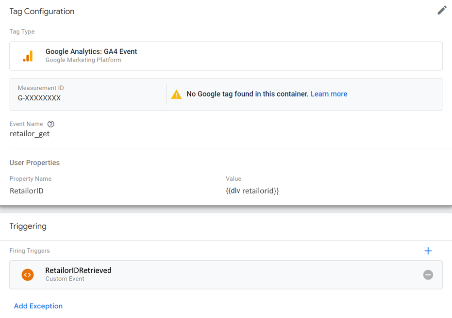

Every time the Retailor Media tag fires, the `retailorid-retrieved` DataLayer event is triggered, which in turn fires the GA4 tag and sends `retailorID` as a user property for cross-device user recognition.

---

### 2.5. WINDOW CUSTOM EVENT TRIGGER

This template features a function to trigger a custom event in the window, providing a useful way for event dispatching.

For instance, if you activate the `retailorid-retrieved` event in the template, you can then call a listener in the code that waits for the Retailor Media event and performs specific actions.

Here's an example of how you might include the `retailorid-retrieved` custom event trigger in the template and then execute code on the website to, for instance, display an alert or run custom code:

```javascript
window.addEventListener('retailorid-retrieved', event => {
  window.alert('Welcome back!');
});
```
